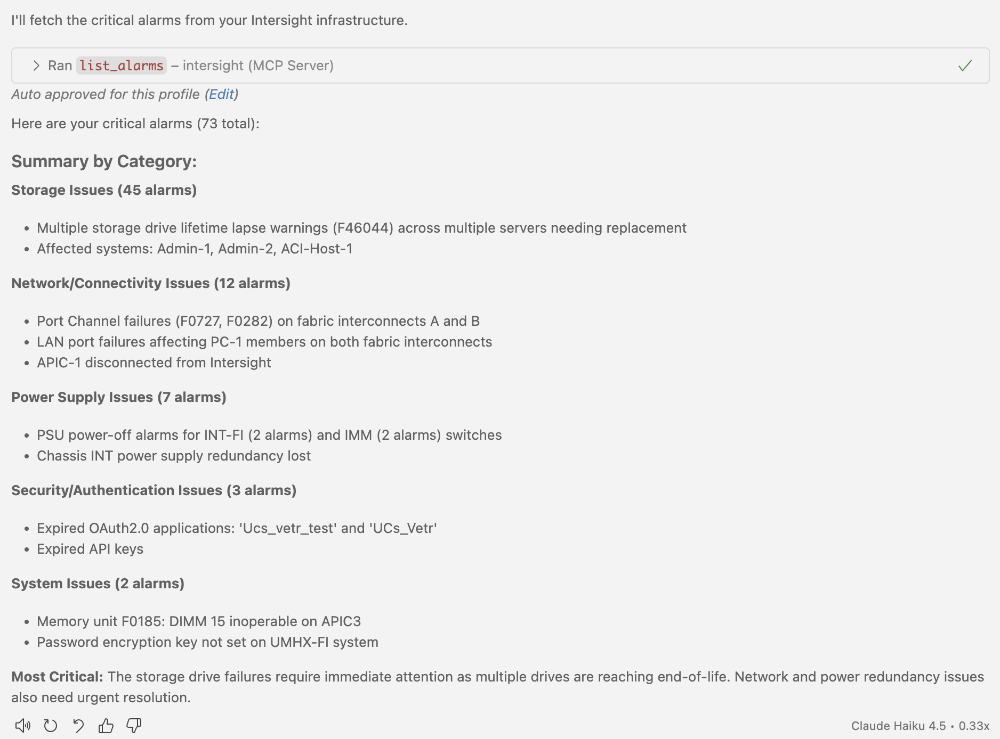
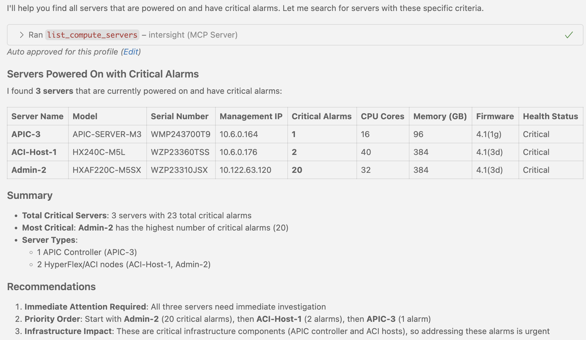
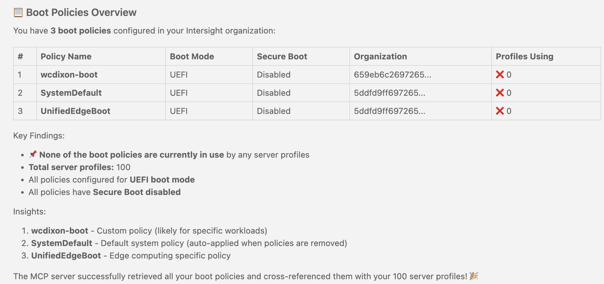

# Intersight MCP Server

An MCP (Model Context Protocol) server that enables LLMs to interact with Cisco Intersight APIs. This server exposes Intersight operations as tools for LLM applications.

### Prerequisites
- Node.js 16+ installed
- VSCode with GitHub Copilot or Claude Desktop
- Intersight API credentials (Key ID + Secret Key)

### 1. Build the Server

```bash
npm install
npm run build
```

### 2. Configure LLM Client

#### For VSCode with GitHub Copilot

1. Open VSCode Settings: `Cmd+Shift+P` → "Preferences: Open User Settings (JSON)"

2. Add this configuration to your `settings.json`:

```json
{
  "github.copilot.chat.mcp.servers": {
    "intersight": {
      "command": "node",
      "args": ["/path/to/intersight-mcp-server/build/index.js"],
      "env": {
        "INTERSIGHT_API_KEY_ID": "your-api-key-id",
        "INTERSIGHT_API_SECRET_KEY_PATH": "/path/to/SecretKey.txt",
        "INTERSIGHT_BASE_URL": "https://intersight.com/api/v1"
      }
    }
  }
}
```

3. Reload VS Code: `Cmd+Shift+P` → "Developer: Reload Window"

#### For Claude Desktop

1. Locate your Claude Desktop configuration file:
   - **macOS:** `~/Library/Application Support/Claude/claude_desktop_config.json`
   - **Windows:** `%APPDATA%\Claude\claude_desktop_config.json`
   - **Linux:** `~/.config/Claude/claude_desktop_config.json`

2. Add this configuration to `claude_desktop_config.json`:

```json
{
  "mcpServers": {
    "intersight": {
      "command": "node",
      "args": ["/path/to/intersight-mcp-server/build/index.js"],
      "env": {
        "INTERSIGHT_API_KEY_ID": "your-api-key-id",
        "INTERSIGHT_API_SECRET_KEY_PATH": "/path/to/SecretKey.txt",
        "INTERSIGHT_BASE_URL": "https://intersight.com/api/v1"
      }
    }
  }
}
```

3. Restart Claude Desktop application

### 3. Test in LLM Client

```
"Show me all critical alarms"
```



## Example Use Cases

### Monitor Infrastructure

```text
"Show me all servers that are powered on and have critical alarms"
```



### Manage Policies

```text
"List all my boot policies and which profiles use each one"
```



## Demo

Watch the Claude Desktop MCP integration in action:


## Features & Tools (198 Total)

### 📦 Inventory & Discovery
- `list_compute_servers` - List all compute servers with optional filtering
- `get_server_details` - Get detailed information about a specific server
- `list_chassis` - List all equipment chassis
- `list_fabric_interconnects` - List fabric interconnects and network elements
- `list_compute_blades` - List all blade servers in chassis
- `list_compute_rack_units` - List all rack-mounted servers
- `list_compute_boards` - List all server motherboards

### 🔔 Monitoring & Alarms
- `list_alarms` - List active alarms with severity filtering
- `acknowledge_alarm` - Acknowledge a specific alarm

### 📋 Policy Management
- `list_policies`, `get_policy` - Browse and retrieve policies
- `create_boot_policy` - Create boot policies (UEFI/Legacy mode)
- `create_bios_policy` - Create BIOS policies
- `create_network_policy` - Create LAN connectivity policies
- `update_policy`, `delete_policy` - Update or delete policies

### 🎯 Pool Management
- `list_pools` - Browse pools by type
- `create_ip_pool` - Create IP address pools
- `create_mac_pool` - Create MAC address pools
- `create_uuid_pool` - Create UUID pools
- `create_wwnn_pool` - Create WWNN pools for Fibre Channel
- `create_wwpn_pool` - Create WWPN pools for Fibre Channel
- `update_pool` - Modify existing pools
- `delete_pool` - Delete resource pools

### 🌐 Network Configuration

- `create_vnic` - Create virtual network interface cards
- `create_vlan_group` - Create VLAN groups (Ethernet Network Group Policies)
- `list_vnics` - List all vNICs or filter by LAN connectivity policy
- `get_vnic` - Get details of a specific vNIC
- `update_vnic` - Update an existing vNIC
- `delete_vnic` - Delete a vNIC
- `list_lan_connectivity_policies` - List all LAN connectivity policies
- `get_lan_connectivity_policy` - Get LAN connectivity policy details
- `list_eth_adapter_policies` - List Ethernet adapter policies
- `list_eth_qos_policies` - List Ethernet QoS policies
- `list_eth_network_group_policies` - List VLAN groups

### ⚙️ Configuration Management 

#### Adapter Configuration 

- `list_adapter_config_policies` - List all Ethernet adapter configuration policies
- `get_adapter_config_policy` - Get adapter policy details by MOID
- `create_adapter_config_policy` - Create new adapter configuration policy
- `update_adapter_config_policy` - Update existing adapter policy
- `delete_adapter_config_policy` - Delete adapter configuration policy

#### Fabric Port Channels 

- `list_fabric_port_channels` - List all fabric port channel configurations
- `get_fabric_port_channel` - Get port channel details by MOID
- `create_fabric_port_channel` - Create new fabric port channel
- `update_fabric_port_channel` - Update existing port channel
- `delete_fabric_port_channel` - Delete fabric port channel

#### VLAN Management 

- `list_fabric_vlans` - List all configured VLANs
- `get_fabric_vlan` - Get VLAN details by MOID
- `create_fabric_vlan` - Create new VLAN
- `update_fabric_vlan` - Update existing VLAN
- `delete_fabric_vlan` - Delete VLAN

#### VSAN/Fibre Channel 

- `list_fabric_vsans` - List all configured VSANs
- `get_fabric_vsan` - Get VSAN details by MOID
- `create_fabric_vsan` - Create new VSAN
- `update_fabric_vsan` - Update existing VSAN
- `delete_fabric_vsan` - Delete VSAN

#### IP Pool Blocks 

- `list_ippool_blocks` - List all IP address pool blocks
- `get_ippool_block` - Get IP pool block details by MOID
- `create_ippool_block` - Create new IP address block in pool
- `update_ippool_block` - Update existing IP pool block
- `delete_ippool_block` - Delete IP pool block

#### MAC Pool Blocks 

- `list_macpool_blocks` - List all MAC address pool blocks
- `get_macpool_block` - Get MAC pool block details by MOID
- `create_macpool_block` - Create new MAC address block in pool
- `update_macpool_block` - Update existing MAC pool block
- `delete_macpool_block` - Delete MAC pool block

#### FC Pool Blocks 

- `list_fcpool_blocks` - List all Fibre Channel pool blocks (WWNN/WWPN)
- `get_fcpool_block` - Get FC pool block details by MOID
- `create_fcpool_block` - Create new FC address block in pool
- `update_fcpool_block` - Update existing FC pool block
- `delete_fcpool_block` - Delete FC pool block

#### Pool Leases 

- `list_pool_leases` - List all pool leases (IP/MAC/UUID/WWN allocations)

### 🌐 Advanced Networking 

#### Fabric Port Management 

- `list_fabric_ports` - List all fabric interconnect physical ports
- `get_fabric_port` - Get fabric port details by MOID
- `list_fabric_uplink_ports` - List all fabric uplink ports
- `list_fabric_server_ports` - List all fabric server ports
- `list_fabric_port_operations` - List all fabric port operations

#### Flow Control Policies 

- `list_fabric_flow_control_policies` - List all flow control policies
- `get_fabric_flow_control_policy` - Get flow control policy details
- `create_fabric_flow_control_policy` - Create flow control policy (PFC, send/receive direction)
- `update_fabric_flow_control_policy` - Update flow control policy
- `delete_fabric_flow_control_policy` - Delete flow control policy

#### Link Control Policies 

- `list_fabric_link_control_policies` - List all link control policies
- `get_fabric_link_control_policy` - Get link control policy details
- `create_fabric_link_control_policy` - Create link control policy (UDLD settings)
- `update_fabric_link_control_policy` - Update link control policy
- `delete_fabric_link_control_policy` - Delete link control policy

#### Link Aggregation (LACP) Policies 

- `list_fabric_lacp_policies` - List all LACP policies
- `get_fabric_lacp_policy` - Get LACP policy details
- `create_fabric_lacp_policy` - Create LACP policy (rate, suspend settings)
- `update_fabric_lacp_policy` - Update LACP policy
- `delete_fabric_lacp_policy` - Delete LACP policy

#### System QoS & Multicast 

- `list_fabric_system_qos_policies` - List all system QoS policies
- `get_fabric_system_qos_policy` - Get system QoS policy details
- `list_fabric_multicast_policies` - List all multicast policies
- `get_fabric_multicast_policy` - Get multicast policy details

#### Multicast Policy Management 

- `create_fabric_multicast_policy` - Create multicast policy (IGMP snooping, querier)
- `update_fabric_multicast_policy` - Update multicast policy
- `delete_fabric_multicast_policy` - Delete multicast policy

### 🔐 Hardware Security & Management 

#### Trusted Platform Module 

- `list_equipment_tpms` - List all TPM (Trusted Platform Module) devices
- `get_equipment_tpm` - Get TPM device details

#### Boot Security 

- `list_boot_device_boot_modes` - List all boot device boot modes
- `list_boot_device_boot_securities` - List all boot device security settings

#### Local Disk Policies 

- `list_storage_local_disk_policies` - List all local disk configuration policies
- `get_storage_local_disk_policy` - Get local disk policy details
- `create_storage_local_disk_policy` - Create local disk policy (Any Config, No Storage, RAID)
- `update_storage_local_disk_policy` - Update local disk policy
- `delete_storage_local_disk_policy` - Delete local disk policy

#### SD Card Policies 

- `list_sdcard_policies` - List all SD card policies
- `get_sdcard_policy` - Get SD card policy details
- `create_sdcard_policy` - Create SD card policy
- `update_sdcard_policy` - Update SD card policy
- `delete_sdcard_policy` - Delete SD card policy

#### KVM Policies 

- `list_kvm_policies` - List all KVM policies
- `get_kvm_policy` - Get KVM policy details
- `create_kvm_policy` - Create KVM policy (video encryption, max sessions)
- `update_kvm_policy` - Update KVM policy
- `delete_kvm_policy` - Delete KVM policy

#### Virtual Media Policies 

- `list_virtual_media_policies` - List all virtual media policies
- `get_virtual_media_policy` - Get virtual media policy details
- `create_virtual_media_policy` - Create virtual media policy
- `update_virtual_media_policy` - Update virtual media policy
- `delete_virtual_media_policy` - Delete virtual media policy

#### Device Security 

- `list_deviceconnector_policies` - List all device connector policies
- `get_deviceconnector_policy` - Get device connector policy details
- `list_certificatemanagement_policies` - List all certificate management policies
- `get_certificatemanagement_policy` - Get certificate policy details

### ⚙️ System Policies 

#### SNMP Policies 

- `list_snmp_policies` - List all SNMP policies
- `get_snmp_policy` - Get SNMP policy details
- `create_snmp_policy` - Create SNMP policy (port, enable/disable)
- `update_snmp_policy` - Update SNMP policy
- `delete_snmp_policy` - Delete SNMP policy

#### Syslog Policies 

- `list_syslog_policies` - List all Syslog policies
- `get_syslog_policy` - Get Syslog policy details
- `create_syslog_policy` - Create Syslog policy
- `update_syslog_policy` - Update Syslog policy
- `delete_syslog_policy` - Delete Syslog policy

#### NTP Policies 

- `list_ntp_policies` - List all NTP policies
- `get_ntp_policy` - Get NTP policy details
- `create_ntp_policy` - Create NTP policy (servers, timezone)
- `update_ntp_policy` - Update NTP policy
- `delete_ntp_policy` - Delete NTP policy

#### SMTP Policies 

- `list_smtp_policies` - List all SMTP policies
- `get_smtp_policy` - Get SMTP policy details
- `create_smtp_policy` - Create SMTP policy (server, port, sender)
- `update_smtp_policy` - Update SMTP policy
- `delete_smtp_policy` - Delete SMTP policy

### 📊 Telemetry & Monitoring

- `get_server_telemetry` - Get server metrics (CPU, Memory, Temperature, Power)
- `get_chassis_telemetry` - Get chassis telemetry (power, thermal, fans, PSUs)
- `get_adapter_telemetry` - Get network adapter statistics
- `get_top_resources` - Get top N resources by metric (CPU, memory, power, temperature)
- `list_processor_units` - List CPU inventory
- `list_memory_units` - List memory modules
- `list_storage_controllers` - List storage controllers
- `list_physical_drives` - List physical disks
- `get_power_statistics` - Get power metrics
- `get_thermal_statistics` - Get temperature data
- `list_fan_modules` - List fan modules
- `list_psu_units` - List power supply units

### 👥 Server Profiles

- `list_server_profiles` - Browse all profiles
- `get_server_profile` - Get profile details
- `create_server_profile` - Create new profiles
- `attach_policy_to_profile` - Attach policies to profiles
- `attach_pool_to_profile` - Attach pools to profiles
- `assign_server_to_profile` - Assign physical servers
- `deploy_server_profile` - Deploy or undeploy profiles
- `update_server_profile` - Modify profiles
- `delete_server_profile` - Remove profiles

### 🔍 Search & Query

- `search_resources` - Search any Intersight resource with OData filters

### 🔧 Hardware Compatibility List (HCL)

- `list_hcl_operating_systems` - List supported operating systems from HCL
- `list_hcl_operating_system_vendors` - List OS vendors from HCL
- `list_hcl_hyperflex_compatibility` - List HyperFlex software compatibility information

### 📢 Technical Advisory Management (TAM)

- `list_tam_advisories` - List all technical advisories and field notices
- `get_tam_advisory` - Get detailed information about a specific advisory
- `list_tam_advisory_instances` - List which devices are affected by advisories
- `list_tam_security_advisories` - List security advisories
- `get_tam_advisory_count` - Get count of advisories by severity

### 🖥️ Terminal & System Topology

- `list_terminal_audit_logs` - List terminal session audit logs for compliance monitoring
- `list_top_systems` - List all top-level systems with compute resources
- `get_top_system` - Get details of a specific system including blades and rack units

### 💾 Storage Management

- `list_storage_virtual_drives` - List all virtual drives (RAID volumes)
- `list_storage_flex_flash_controllers` - List all FlexFlash controllers
- `list_storage_flex_flash_drives` - List all FlexFlash physical drives

### ⚙️ Equipment & Hardware

- `list_equipment_io_cards` - List all IO cards in chassis
- `list_equipment_sys_io_ctrls` - List all system IO controllers

### 📀 Firmware Management

- `list_firmware_running` - List all running firmware versions across infrastructure
- `list_firmware_upgrades` - List all firmware upgrade operations

### 🔑 License Management

- `list_licenses` - List all license information for registered devices

### 🔄 Workflow Automation

- `list_workflows` - List all workflow executions
- `get_workflow` - Get details of a specific workflow execution
- `list_workflow_tasks` - List all workflow task executions

### 🎴 PCI & Hardware Devices

- `list_pci_devices` - List all PCI devices (NICs, HBAs, GPUs, etc.)
- `list_graphics_cards` - List all graphics cards (GPUs)

### 🔧 BIOS & Firmware

- `list_bios_units` - List all BIOS/UEFI firmware units

### 🖧 Management Controllers

- `list_management_controllers` - List all management controllers (CIMC, IMC, BMC)
- `list_management_interfaces` - List all management network interfaces

### 📚 PowerShell SDK Examples

- `get_powershell_examples` - Access Cisco Intersight PowerShell module programming examples from GitHub (89 categories with 500+ examples)

### 🐍 Python SDK Examples & Utilities

- `get_python_examples` - Access Cisco Intersight Python SDK examples and utilities from GitHub (30+ scripts from 2 repositories)

### 🏗️ Terraform Infrastructure Modules & Registry

- `get_terraform_examples` - Access Terraform Registry documentation AND GitHub modules (dual-source Terraform support)

## Version History

### Version 1.0.12

**Enhanced Terraform Support with Registry Integration**
- ✅ **Terraform Tool Enhancement**
  - `get_terraform_examples` - Now accesses BOTH Terraform Registry and GitHub modules
  - **Terraform Registry Integration**: Direct links to official provider documentation at registry.terraform.io
  - **Resource Documentation**: Get resource and data source documentation URLs for any Intersight Terraform resource
  - **GitHub Modules**: Access to 4 comprehensive IaC modules with actual .tf configuration files
  - **Dual-source filtering**: Choose "registry" (docs), "modules" (code), or "all" (both)
  - **Complete Terraform coverage**: Documentation for syntax + working code examples

### Version 1.0.11

**Terraform Infrastructure Modules Integration**
- ✅ **Terraform Modules Tool**
  - `get_terraform_examples` - Retrieve Terraform Infrastructure as Code modules from CiscoDevNet GitHub repository
  - Access to 4 comprehensive modules: intersight-imm (IMM policies), intersight-domain-profiles, intersight-moids, intersight-sds
  - Returns Terraform configuration files (.tf) including compute, network, management, and storage policies
  - Includes example variable files (example.auto.tfvars) for quick setup
  - Perfect for infrastructure automation and policy-as-code deployments

### Version 1.0.10

**Python Examples & Utilities Integration**
- ✅ **Python SDK Examples Tool**
  - `get_python_examples` - Retrieve Python code examples from multiple CiscoUcs/CiscoDevNet GitHub repositories
  - Access to SDK examples (CiscoUcs/intersight-python) - 5 foundational examples
  - Access to Python utilities (CiscoDevNet/intersight-python-utils) - 25+ utility scripts
  - Filter by source: "examples", "utils", or "all" (default)
  - Search by topic: servers, policies, firmware, workflows, audit, deployment, etc.
  - Returns actual Python code for learning and reference

### Version 1.0.9

**PowerShell Examples Integration**
- ✅ **PowerShell SDK Examples Tool**
  - `get_powershell_examples` - Retrieve PowerShell code examples from CiscoDevNet GitHub repository
  - Access to 89 example categories covering all Intersight operations
  - Returns actual PowerShell code for compute, storage, network policies, and more
  - Perfect for learning PowerShell SDK usage patterns and best practices

### Version 1.0.8

**Features Added:**

- ✅ **Fabric Port Management Tools**
  - `list_fabric_ports` - List all fabric interconnect physical ports
  - `get_fabric_port` - Get fabric port details by MOID
  - `list_fabric_uplink_ports` - List all fabric uplink ports
  - `list_fabric_server_ports` - List all fabric server ports
  - `list_fabric_port_operations` - List all fabric port operations

- ✅ **Flow Control Policy Tools**
  - `list_fabric_flow_control_policies` - List all flow control policies
  - `get_fabric_flow_control_policy` - Get flow control policy details by MOID
  - `create_fabric_flow_control_policy` - Create flow control policy (PFC, send/receive direction)
  - `update_fabric_flow_control_policy` - Update flow control policy
  - `delete_fabric_flow_control_policy` - Delete flow control policy

- ✅ **Link Control Policy Tools**
  - `list_fabric_link_control_policies` - List all link control policies
  - `get_fabric_link_control_policy` - Get link control policy details by MOID
  - `create_fabric_link_control_policy` - Create link control policy (UDLD settings)
  - `update_fabric_link_control_policy` - Update link control policy
  - `delete_fabric_link_control_policy` - Delete link control policy

- ✅ **Link Aggregation (LACP) Policy Tools**
  - `list_fabric_lacp_policies` - List all LACP policies
  - `get_fabric_lacp_policy` - Get LACP policy details by MOID
  - `create_fabric_lacp_policy` - Create LACP policy (rate, suspend settings)
  - `update_fabric_lacp_policy` - Update LACP policy
  - `delete_fabric_lacp_policy` - Delete LACP policy

- ✅ **System QoS Tools**
  - `list_fabric_system_qos_policies` - List all system QoS policies
  - `get_fabric_system_qos_policy` - Get system QoS policy details by MOID

- ✅ **Multicast Policy Tools**
  - `list_fabric_multicast_policies` - List all multicast policies
  - `get_fabric_multicast_policy` - Get multicast policy details by MOID
  - `create_fabric_multicast_policy` - Create multicast policy (IGMP snooping, querier)
  - `update_fabric_multicast_policy` - Update multicast policy
  - `delete_fabric_multicast_policy` - Delete multicast policy

- ✅ **Trusted Platform Module (TPM) Tools**
  - `list_equipment_tpms` - List all TPM (Trusted Platform Module) devices
  - `get_equipment_tpm` - Get TPM device details by MOID

- ✅ **Boot Security Tools**
  - `list_boot_device_boot_modes` - List all boot device boot modes
  - `list_boot_device_boot_securities` - List all boot device security settings

- ✅ **Local Disk Policy Tools**
  - `list_storage_local_disk_policies` - List all local disk configuration policies
  - `get_storage_local_disk_policy` - Get local disk policy details by MOID
  - `create_storage_local_disk_policy` - Create local disk policy (Any Config, No Storage, RAID)
  - `update_storage_local_disk_policy` - Update local disk policy
  - `delete_storage_local_disk_policy` - Delete local disk policy

- ✅ **SD Card Policy Tools**
  - `list_sdcard_policies` - List all SD card policies
  - `get_sdcard_policy` - Get SD card policy details by MOID
  - `create_sdcard_policy` - Create SD card policy
  - `update_sdcard_policy` - Update SD card policy
  - `delete_sdcard_policy` - Delete SD card policy

- ✅ **KVM Policy Tools**
  - `list_kvm_policies` - List all KVM policies
  - `get_kvm_policy` - Get KVM policy details by MOID
  - `create_kvm_policy` - Create KVM policy (video encryption, max sessions)
  - `update_kvm_policy` - Update KVM policy
  - `delete_kvm_policy` - Delete KVM policy

- ✅ **Virtual Media Policy Tools**
  - `list_virtual_media_policies` - List all virtual media policies
  - `get_virtual_media_policy` - Get virtual media policy details by MOID
  - `create_virtual_media_policy` - Create virtual media policy
  - `update_virtual_media_policy` - Update virtual media policy
  - `delete_virtual_media_policy` - Delete virtual media policy

- ✅ **Device Security Tools**
  - `list_deviceconnector_policies` - List all device connector policies
  - `get_deviceconnector_policy` - Get device connector policy details by MOID
  - `list_certificatemanagement_policies` - List all certificate management policies
  - `get_certificatemanagement_policy` - Get certificate policy details by MOID

- ✅ **SNMP Policy Tools**
  - `list_snmp_policies` - List all SNMP policies
  - `get_snmp_policy` - Get SNMP policy details by MOID
  - `create_snmp_policy` - Create SNMP policy (port, enable/disable)
  - `update_snmp_policy` - Update SNMP policy
  - `delete_snmp_policy` - Delete SNMP policy

- ✅ **Syslog Policy Tools**
  - `list_syslog_policies` - List all Syslog policies
  - `get_syslog_policy` - Get Syslog policy details by MOID
  - `create_syslog_policy` - Create Syslog policy
  - `update_syslog_policy` - Update Syslog policy
  - `delete_syslog_policy` - Delete Syslog policy

- ✅ **NTP Policy Tools**
  - `list_ntp_policies` - List all NTP policies
  - `get_ntp_policy` - Get NTP policy details by MOID
  - `create_ntp_policy` - Create NTP policy (servers, timezone)
  - `update_ntp_policy` - Update NTP policy
  - `delete_ntp_policy` - Delete NTP policy

- ✅ **SMTP Policy Tools**
  - `list_smtp_policies` - List all SMTP policies
  - `get_smtp_policy` - Get SMTP policy details by MOID
  - `create_smtp_policy` - Create SMTP policy (server, port, sender)
  - `update_smtp_policy` - Update SMTP policy
  - `delete_smtp_policy` - Delete SMTP policy

**Improvements:**

- Comprehensive fabric network control with flow control, link control, and LACP
- Advanced hardware security management with TPM, boot security, and KVM
- Complete system policy management for monitoring and notifications
- Enhanced storage management with local disk and SD card policies
- Virtual media management for remote installations

### Version 1.0.7

**Features Added:**

- ✅ **Adapter Configuration Tools**
  - `list_adapter_config_policies` - List all Ethernet adapter configuration policies
  - `get_adapter_config_policy` - Get adapter policy details by MOID
  - `create_adapter_config_policy` - Create new adapter configuration policy
  - `update_adapter_config_policy` - Update existing adapter policy
  - `delete_adapter_config_policy` - Delete adapter configuration policy

- ✅ **Fabric Port Channel Tools**
  - `list_fabric_port_channels` - List all fabric port channel configurations
  - `get_fabric_port_channel` - Get port channel details by MOID
  - `create_fabric_port_channel` - Create new fabric port channel
  - `update_fabric_port_channel` - Update existing port channel
  - `delete_fabric_port_channel` - Delete fabric port channel

- ✅ **VLAN Management Tools**
  - `list_fabric_vlans` - List all configured VLANs
  - `get_fabric_vlan` - Get VLAN details by MOID
  - `create_fabric_vlan` - Create new VLAN
  - `update_fabric_vlan` - Update existing VLAN
  - `delete_fabric_vlan` - Delete VLAN

- ✅ **VSAN/Fibre Channel Tools**
  - `list_fabric_vsans` - List all configured VSANs
  - `get_fabric_vsan` - Get VSAN details by MOID
  - `create_fabric_vsan` - Create new VSAN
  - `update_fabric_vsan` - Update existing VSAN
  - `delete_fabric_vsan` - Delete VSAN

- ✅ **IP Pool Block Tools**
  - `list_ippool_blocks` - List all IP address pool blocks
  - `get_ippool_block` - Get IP pool block details by MOID
  - `create_ippool_block` - Create new IP address block in pool
  - `update_ippool_block` - Update existing IP pool block
  - `delete_ippool_block` - Delete IP pool block

- ✅ **MAC Pool Block Tools**
  - `list_macpool_blocks` - List all MAC address pool blocks
  - `get_macpool_block` - Get MAC pool block details by MOID
  - `create_macpool_block` - Create new MAC address block in pool
  - `update_macpool_block` - Update existing MAC pool block
  - `delete_macpool_block` - Delete MAC pool block

- ✅ **FC Pool Block Tools**
  - `list_fcpool_blocks` - List all Fibre Channel pool blocks (WWNN/WWPN)
  - `get_fcpool_block` - Get FC pool block details by MOID
  - `create_fcpool_block` - Create new FC address block in pool
  - `update_fcpool_block` - Update existing FC pool block
  - `delete_fcpool_block` - Delete FC pool block

- ✅ **Pool Lease Tools**
  - `list_pool_leases` - List all pool leases (IP/MAC/UUID/WWN allocations)

**Improvements:**

- Complete CRUD operations for all configuration management categories
- Comprehensive fabric network management (port channels, VLANs, VSANs)
- Advanced resource pool block management for IP, MAC, and Fibre Channel addresses
- Enhanced adapter configuration policy management

### Version 1.0.6

**Features Added:**

- ✅ **Compute Inventory Tools**
  - `list_compute_blades` - List all blade servers in chassis
  - `list_compute_rack_units` - List all rack-mounted servers  
  - `list_compute_boards` - List all server motherboards

- ✅ **Storage Management Tools**
  - `list_storage_virtual_drives` - List all virtual drives (RAID volumes)
  - `list_storage_flex_flash_controllers` - List all FlexFlash controllers
  - `list_storage_flex_flash_drives` - List all FlexFlash physical drives

- ✅ **Equipment & Hardware Tools**
  - `list_equipment_io_cards` - List all IO cards in chassis
  - `list_equipment_sys_io_ctrls` - List all system IO controllers

- ✅ **Firmware Management Tools**
  - `list_firmware_running` - List all running firmware versions across infrastructure
  - `list_firmware_upgrades` - List all firmware upgrade operations

- ✅ **License Management Tools**
  - `list_licenses` - List all license information for registered devices

- ✅ **Workflow Automation Tools**
  - `list_workflows` - List all workflow executions
  - `get_workflow` - Get details of a specific workflow execution
  - `list_workflow_tasks` - List all workflow task executions

- ✅ **PCI & Hardware Device Tools**
  - `list_pci_devices` - List all PCI devices (NICs, HBAs, GPUs, etc.)
  - `list_graphics_cards` - List all graphics cards (GPUs)

- ✅ **BIOS & Firmware Tools**
  - `list_bios_units` - List all BIOS/UEFI firmware units

- ✅ **Management Controller Tools**
  - `list_management_controllers` - List all management controllers (CIMC, IMC, BMC)
  - `list_management_interfaces` - List all management network interfaces

**Improvements:**

- Comprehensive compute inventory with blade and rack server details
- Enhanced storage visibility including virtual drives and FlexFlash
- Firmware version tracking across all infrastructure components
- License compliance monitoring
- Workflow execution history and debugging
- PCI device and GPU inventory
- Management controller and interface visibility

### Version 1.0.5

**Features Added:**

- ✅ **Terminal & System Topology Tools**
  - `list_terminal_audit_logs` - List terminal session audit logs for compliance and security monitoring
  - `list_top_systems` - List all top-level systems with associated compute resources (blades and rack units)
  - `get_top_system` - Get detailed information about a specific system including compute resources and network elements

**Improvements:**

- Terminal session audit logging for security compliance
- System topology visibility with compute resource associations
- Enhanced infrastructure mapping and resource tracking

### Version 1.0.4

**Features Added:**

- ✅ **Hardware Compatibility List (HCL) Tools**
  - `list_hcl_operating_systems` - List supported operating systems from HCL
  - `list_hcl_operating_system_vendors` - List OS vendors from HCL  
  - `list_hcl_hyperflex_compatibility` - List HyperFlex software compatibility information
- ✅ **Technical Advisory Management (TAM) Tools**
  - `list_tam_advisories` - List all technical advisories and field notices affecting infrastructure
  - `get_tam_advisory` - Get detailed information about a specific advisory including recommendations
  - `list_tam_advisory_instances` - List which specific devices are affected by advisories
  - `list_tam_security_advisories` - List security advisories with CVE information
  - `get_tam_advisory_count` - Get count of advisories by severity level

**Improvements:**

- Complete visibility into hardware compatibility information
- Proactive monitoring of technical advisories and security bulletins
- Direct access to field notices and affected device tracking
- Enhanced infrastructure risk management capabilities

### Version 1.0.3

**Features Added:**

- ✅ **Complete vNIC Management**
  - `list_vnics` - List all vNICs or filter by LAN connectivity policy
  - `get_vnic` - Get details of a specific vNIC
  - `update_vnic` - Update an existing vNIC configuration
  - `delete_vnic` - Delete a vNIC from a LAN connectivity policy
  - `list_lan_connectivity_policies` - Browse all LAN connectivity policies
  - `get_lan_connectivity_policy` - Get detailed LAN connectivity policy information
  - `list_eth_adapter_policies` - List available Ethernet adapter policies
  - `list_eth_qos_policies` - List available Ethernet QoS policies
  - `list_eth_network_group_policies` - List all VLAN groups
- ✅ **Enhanced Telemetry**
  - `get_top_resources` - Rank and identify top N resources by metrics (CPU, Memory, Power, Temperature)

**Improvements:**

- Complete CRUD operations for vNIC management
- Comprehensive policy discovery for vNIC configuration
- Ability to list and filter resources by parent policy
- Enhanced infrastructure analytics with top resource identification

### Version 1.0.2

**Features Added:**

- ✅ **Telemetry & Monitoring (11 tools)**
  - `get_server_telemetry` - Comprehensive server metrics (CPU, Memory, Temperature, Power)
  - `get_chassis_telemetry` - Chassis-level telemetry (power, thermal, fans, PSUs)
  - `get_adapter_telemetry` - Network adapter interface statistics
  - `list_processor_units` - CPU inventory and status across infrastructure
  - `list_memory_units` - Memory module inventory
  - `list_storage_controllers` - Storage controller inventory
  - `list_physical_drives` - Physical disk inventory
  - `get_power_statistics` - Server and chassis power metrics
  - `get_thermal_statistics` - Temperature data for servers and chassis
  - `list_fan_modules` - Fan module inventory and status
  - `list_psu_units` - Power supply unit inventory
- ✅ **Pool Management**
  - `delete_pool` - Delete resource pools by type and MOID

**Improvements:**

- Enhanced error handling for telemetry data aggregation
- Added comprehensive hardware monitoring capabilities
- Full support for infrastructure health metrics

### Version 1.0.1

**Features Added:**

- ✅ **Network Configuration (2 tools)**
  - `create_vnic` - Create virtual network interface cards with full policy support
  - `create_vlan_group` - Create VLAN groups (Ethernet Network Group Policies)
- ✅ **Enhanced vNIC Creation**
  - Support for Ethernet Adapter Policy references
  - Support for QoS Policy references
  - Support for Ethernet Network Group Policy (VLAN groups)
  - Fabric placement (A/B)
  - MAC pool assignment
  - Failover configuration
  - CDN (Consistent Device Naming) support

**Improvements:**

- Fixed vNIC policy references to use proper ObjectType structures
- Added comprehensive policy validation for vNIC creation
- Support for both FI-Attached and Standalone network configurations

### Version 1.0.0

**Released:** October 2025

**Initial Release Features:**

- ✅ **Core Infrastructure (4 tools)**
  - Server inventory and discovery
  - Chassis and fabric interconnect management
  - Detailed server information retrieval
- ✅ **Alarm Management (2 tools)**
  - List and filter alarms by severity
  - Acknowledge alarms
- ✅ **Policy Management (8 tools)**
  - Boot policies (UEFI/Legacy)
  - BIOS policies
  - Network/LAN connectivity policies
  - Policy CRUD operations
- ✅ **Pool Management (7 tools)**
  - IP, MAC, UUID pool creation
  - WWNN/WWPN pool creation for Fibre Channel
  - Pool update operations
- ✅ **Server Profiles (9 tools)**
  - Profile lifecycle management
  - Policy and pool attachment
  - Server assignment and deployment
- ✅ **Advanced Search**
  - OData query support for all Intersight resources

https://www.cisco.com/c/en/us/support/docs/cloud-systems-management/catalyst-center/223278-harness-the-power-of-mcp-servers.html


